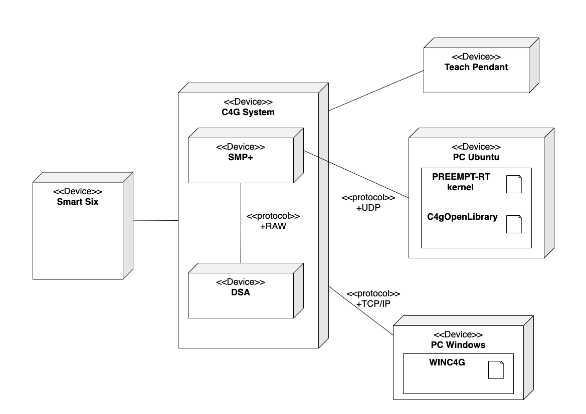
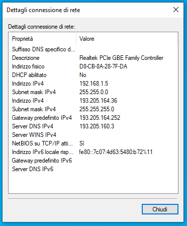
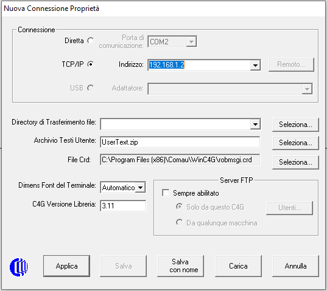
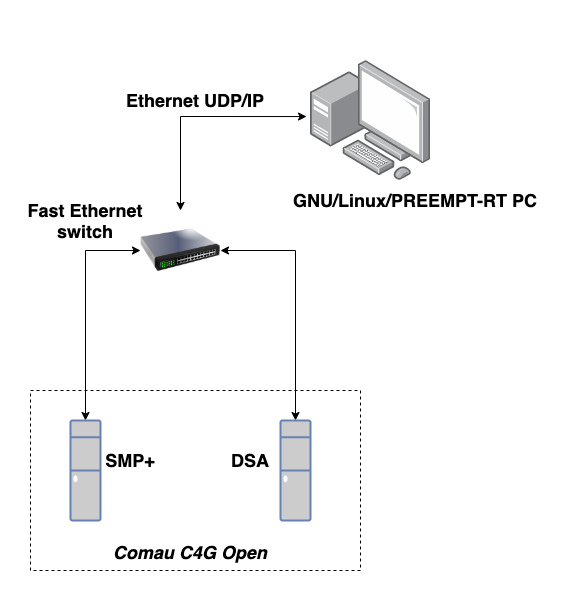

# **Cooperating Comau Smart-Six workcell**

## **Single robot architecture overview**



## **WINC4G**

In this section we provide a short introduction to the WINC4G software and the actual configuration used by the Automatic Control Group of the University of Salerno.
For more information about WinC4G software, check the links given in the text below.

### Short introduction to WINC4G

The WINC4G is a software provided by COMAU.
It is a graphical interface, on the Personal Computer, to the C4G control unit. By using this software, it is possible to:

- Show, edit and remove files from the C4G memory
- Translate source PDL2 files into executables (COD extension)
- Debug PDL2 files
- Open a terminal that allows sending messages to the control unit

### WINC4G installation

Use the Setup.exe file from the WinC4G software directory provided by Comau.

*NOTE: This is a Windows software, for the other software mentioned in this guide, you will need a Linux-based machine.*

### Connect WINC4G to the control unit - Preparation

There are several ways to connect the C4G control unit to the WINC4G software:

- Ethernet LAN
- Ethernet point-to-point
- Remote connection through the Internet
- Serial line
- FTP server mode

In this setup, **it has been used an Ethernet LAN connection**.
For more information, check Section 7 of [C4G guide](doc/c4g_guide_it.pdf).

To use this mode you need to:

- Configure a second IP address on the same subnet of the control unit
- Set the `Subnet Mask` to 255.255.0.0
- Set the `Gateway` empty

*NOTE: You can retrieve the IP address of the control unit from the main page of the TP.*

For example, if the control unit has an address like `192.168.*.*`, you have a configuration like



### Connect WINC4G to the control unit - Connect

Launch the `WinC4g.exe` file; following the previous example, you have a starting menu like



Make sure to set the `TCP/IP` address of the C4G controller.

For more information about additional configurations, see Section 7.3 of the [C4G guide](doc/c4g_guide_it.pdf).

## **PREEMPT-RT**

### Short introduction to PREEMPT-RT

Preemptive Real Time (PREEMPT-RT) consists of a patched Linux kernel to make Linux real-time. PREEMPT-RT allows the developer to simply use `pthread` for real-time threads, as any other thread. The real-time behavior can be enforced by setting the thread priority to values greater than or equal to 80. Applications are developed through standard POSIX calls.

For more information check [PREEMPT-RT](https://rt.wiki.kernel.org/).

### Why you need PREEMPT-RT

The difference between an RTOS and a general purpose OS is that, with an RTOS, the response times are known.
In our application, a **real time communication must be active** between the C4G controller and the PC.
The PC must send back an answer packet to any packet received from SMP+ in max 2 ms; if this doesn’t happen, the C4G Open modality is disabled, issuing a suitable error message and, depending on the situation, either the C4G System takes the control again or a software error is triggered with a different priority depending on the machine state.
Because a general purpose OS is not deterministic with a high interrupt latency, you need to use PREEMPT-RT.

### Tested setup

This guide has been tested with Ubuntu 20.04 LTS (x86_64 installation) and the following RT kernel versions

- PREEMPT-RT Kernel Linux 5.6.19-rt12
- PREEMPT-RT Kernel Linux 5.15.55-rt48

*NOTE: Refer to the Ubuntu and PREEMPT-RT documentation for a different combination of the elements above.*

### Preparing to install - package requirements

Open Software & Updates. In the Ubuntu Software menu, tick the ‘Source code’ box.

Some tools are needed to build the RT kernel, install them with

```bash
sudo apt-get build-dep linux
sudo apt-get install libncurses-dev flex bison openssl libssl-dev dkms libelf-dev libudev-dev libpci-dev libiberty-dev autoconf fakeroot
```

### Preparing to install - download the kernel and its RT patch

Create a directory in the home directory with

```bash
mkdir ~/kernel
```

and switch into it with

```bash
cd ~/kernel
```

Browse to <https://mirrors.edge.kernel.org/pub/linux/kernel/v5.x/> and look for your kernel version. You can check your current version by running:

```bash
uname -r
```

You can download it from the site and move it manually to `~/kernel`, or download it using `wget`. For example:

```bash
wget https://mirrors.edge.kernel.org/pub/linux/kernel/v5.x/linux-5.6.19.tar.gz
```

Unpack it with

```bash
tar -xf linux-*.tar.gz
```

Download the `rt_preempt` patch at <http://cdn.kernel.org/pub/linux/kernel/projects/rt/>, matching the kernel version just downloaded above. For example

```bash
wget http://cdn.kernel.org/pub/linux/kernel/projects/rt/5.6/older/patch-5.6.19-rt12.patch.gz
```

Unpack it with

```bash
gunzip patch-*.gz
```

### Patch the downloaded kernel

Switch into the linux directory with

```bash
cd linux-*/
```

and patch the kernel with the realtime patch

```bash
patch -p1 < ../patch-*.patch
```

### Create a configuration file

Being usually hard for a generic user to fully understand all the options of the kernel configuration menu, starting from a working configuration file is generally a good choice.

Pick the configuration of your Ubuntu installation and copy it as `.config` to your patched kernel's directory with

```bash
cp -v /boot/config-$(uname -r) .config
```

Now, this configuration is modified to account for the real-time kernel. To enable all Ubuntu configurations, use

```bash
yes '' | make oldconfig
```

Then enable `rt_preempt` in the kernel. So call

```bash
make menuconfig
```

and set the following

```text
# Enable CONFIG_PREEMPT_RT
-> General Setup
 -> Preemption Model
  (X) Fully Preemptible Kernel (Real-Time)

# Enable CONFIG_HIGH_RES_TIMERS
-> General setup
 -> Timers subsystem
  [*] High Resolution Timer Support

# Enable CONFIG_NO_HZ_FULL
-> General setup
 -> Timers subsystem
  -> Timer tick handling
   (X) Full dynticks system (tickless)

# Enable CONFIG_HZ_1000 (note: this is no longer in the 'General Setup' menu, go back to the main menu)
-> Processor type and features
 -> Timer frequency
  (X) 1000 HZ

# Enable CONFIG_CPU_FREQ_DEFAULT_GOV_PERFORMANCE (note: this is no longer in the 'Processor type and features' menu, go back to the main menu)
-> Power management and ACPI options
 -> CPU Frequency scaling
  -*- CPU Frequency scaling
  -> Default CPUFreq governor
   (X) performance
```

The `.config` file into the `doc` directory of this package is the working configuration used in this guide.

**IMPORTANT NOTES:**

- Before continuing with the next section, it could be necessary to comment out some variables into the `.config` file, otherwise errors at compile time will occur, e.g.

```bash
make[2]: *** [debian/rules:6: build] Error 2
dpkg-buildpackage: Error: debian/rules build subprocess returned exit status 2
make[1]: *** [scripts/Makefile.package:77: deb-pkg] Error 2
make: *** [Makefile:1464: deb-pkg] Error 2
```

In particular, add a `#` at the variables `CONFIG_MODULE_SIG_KEY`, `CONFIG_SYSTEM_TRUSTED_KEYS` and `CONFIG_SYSTEM_REVOCATION_KEYS` (if present) to comment them out. In general, any variable referring to some `*.pem` file should be commented out.

- If your machine has secure boot configured, disable it in the BIOS settings since the patched kernel will not have a valid signature, otherwise it will not boot.

### Build and install the kernel

Save and exit menuconfig. Now build the kernel, which will take quite some time (10-30 minutes on a modern CPU):

```bash
make -j$(nproc) deb-pkg
```

After the build is finished check the debian packages

```bash
ls ../*deb
../linux-headers-5.6.19-rt12_5.6.19-rt12-1_amd64.deb ../linux-image-5.6.19-rt12-dbg_5.6.19-rt12-1_amd64.deb ../linux-image-5.6.19-rt12_5.6.19-rt12-1_amd64.deb ../linux-libc-dev_5.6.19-rt12-1_amd64.deb
```

Then you install all kernel debian packages

```bash
sudo dpkg -i ../*.deb
```

Now the real time kernel should be installed. Reboot the system and check the new kernel version

```text
sudo reboot
uname -a
Linux PCAUT-03 5.6.19-rt12 #1 SMP PREEMPT_RT Thu Jul 29 16:39:04 CEST 2021 x86_64 x86_64 x86_64 GNU/Linux
```

**IMPORTANT NOTES:**

- When the system reboots it might get stuck with a black screen with only a stationary cursor. This issue might be related to NVIDIA drivers (if present on your system). Follow the following procedure:

1. After turning on your PC, hold the right SHIFT key to get to the GRUB bootloader, if your computer uses a BIOS. If your computer uses EFI or UEFI, continuously tap the “ESC” (escape) key after turning on your PC.
2. Once GRUB is open, press the “e” key to edit the entry referring to the patched Linux kernel for "Ubuntu”.
3. Move your cursor down to the line that starts with “linux”, and use the right arrow key to find the section with the words “ro quiet splash”.
4. Add “nomodeset” after these words (without quotes).
5. Feel free to remove “quiet” and “splash” for more verbosity to troubleshoot the boot process.
6. Press “CTRL + X” or “F10” to boot.
7. The system should now boot.

### Setup the grub

Setup the grub menu in order to show all the kernels installed.
Reboot your system, if you can select the PREEMPT-RT kernel, you can skip this step.
If there only is the standard linux-generic kernel, do the following (although other ways exist to setup the grub)

```bash
nano /etc/default/grub
```

modify the `GRUB_DEFAULT` and `GRUB_CMDLINE_LINUX_DEFAULT` as:

```text
GRUB_DEFAULT="Advanced options for Ubuntu>Ubuntu, with Linux 5.6.19-rt12"
GRUB_CMDLINE_LINUX_DEFAULT="quiet splash nomodeset"
```

update the grub:

```bash
update-grub
```

Reboot your system.

### Test PREEMPT-RT

Once your PREEMPT-RT kernel is installed, you can test the system latency. For that, you need the Real-Time tests that are available under the `rt-tests` Debian package. Cyclictest must be run as root, with sudo, or as a member of the realtime group (as described at [realtime documentation](https://wiki.linuxfoundation.org/realtime/documentation/howto/tools/cyclictest/start)).

```bash
sudo cyclictest -N -p 90 -i 1000
```

With such a command, you should have an average latency less than 10us. If not, there is probably an error in your setup or your hardware. An expected output of this command's execution shoud be

```text
# /dev/cpu_dma_latency set to 0us
policy: fifo: loadavg: 2.12 1.72 1.01 2/741 3504
policy: fifo: loadavg: 2.12 1.72 1.01 1/741 3504
policy: fifo: loadavg: 2.12 1.72 1.01 3/741 3504          0 Avg:       0 Max:
policy: fifo: loadavg: 2.12 1.72 1.01 2/741 3504          1 Avg:    3295 Max:
policy: fifo: loadavg: 2.12 1.72 1.01 2/741 3504          4 Avg:    3010 Max:
policy: fifo: loadavg: 2.12 1.72 1.01 1/741 3504          9 Avg:    3016 Max:
policy: fifo: loadavg: 2.12 1.72 1.01 1/741 3504          5 Avg:    2915 Max:
policy: fifo: loadavg: 2.12 1.72 1.01 2/741 3504          7 Avg:    2905 Max:

...

policy: fifo: loadavg: 2.12 1.72 1.01 1/741 3504          9 Avg:    2912 Max:
policy: fifo: loadavg: 2.12 1.72 1.01 2/741 3504          5 Avg:    2910 Max:
policy: fifo: loadavg: 2.12 1.72 1.01 2/741 3504          0 Avg:    2902 Max:
T: 0 ( 3504) P:90 I:1000 C:    282 Min:   2400 Act:    2969 Avg:    2901 Max:
T: 0 ( 3504) P:90 I:1000 C:    292 Min:   2400 Act:    2522 Avg:    2895 Max:    6642
```

`Min`, `Act`, `Avg` and `Max` values are respectively Minimum latency that was measured (in ns), Latency measured during the latest completed iteration (in ns), Average latency (in ns) and Maximum latency that was measured (in ns). Indeed, it can be observed that average latency `Avg` is below 10us.

The following command will also produce an histogram of the latencies:

```bash
sudo cyclictest -h 100 -q -i 1000 -l 1000000 -N -p 90 -t 4
```

### Configure real-time group

Real-time threads need specific privileges to execute, that can be assigned to a group of users called, for example, `realtime`. Users belonging to this group can execute real-time threads without root privileges. Create the `realtime` group with

```bash
sudo addgroup realtime
```

and add your user to the group with

```bash
sudo usermod -a -G realtime $(whoami)
```

Associate privileges to the `realtime` group by adding the following lines in `/etc/security/limits.conf`:

```bash
@realtime soft rtprio 99
@realtime soft priority 99
@realtime soft memlock unlimited
@realtime hard rtprio 99
@realtime hard priority 99
@realtime hard memlock unlimited
```

The changes will take effect after logging out and back in again.

## **C4G Open architecture & driver**

In this section there are the guidelines to make your system ready to use the C4G Open driver, including a list of all HW/SW requirements, and the procedures to install the driver using catkin.

### Introduction to the driver

The C4G Open Library (the driver), distributed under the terms of GNU LGPL (GNU Lesser General Public License), is a C++ library whose aim is interfacing a GNU/Linux/PREEMPT-RT PC with the “C4G Open” solution, in order to use all the operative modes provided by the Comau C4G controller.
The control of the robot is achieved by the development of PC applications that makes use of the C4G Open Library APIs.

### Short C4G Open system overview

C4G Open is a software extension of the Comau C4G controller for industrial robots that allows a C4G to interact with an external device like a PC.

A C4G Open system is constituted by the following elements:

- the SMP+ (System Master Processor Plus), that hosts the C4G system software, PDL2 interpreter and trajectory generator
- the DSA (Digital Servo Amplifier), that hosts the control code for position, velocity and current loops
- a PC, that is the external device interacting with C4G
- a Fast Ethernet switch (inside the cabinet)



The communication between the PC and the C4G controller is based on the UDP/IP protocol: the PC acts as a server, while the C4G controller acts as a client running on SMP+. The communication requires hard real-time capabilities: the PC must reply to the C4G controller in the established cycle time (1 ms or 2 ms). This requirement is satisfied by the means of the PREEMPT-RT Linux patched kernel.

### Communication packet

The application layer of the PC-C4G communication is based upon the exchange of the following packet


### Operative modes supported by the driver

The are several operative modes actually supported by the C4G Open Library and the C4G Open extension of the Comau C4G controller.

- Mode 0, that is the Open Controller default modality and it is the system standard functionality with the additional requirement of a hard real-time communication with the PC (the PC, even though it does not actively participate to the robot motion, must be present and answer back to each packet received from SMP+);
- Mode 0’ (also called Mode 10 from the Comau documentation), that is a debug mode aiming at verifying packets exchange between the C4G and the PC;
- Mode 1, that is the most complete open mode, since the PC must supply every open-enabled axis with target position, target velocity, feedforward velocity and feedforward current;
- Mode 2, that requires the PC to supply every open-enabled axis with feedforward velocity and feedforward current;
- Mode 4, that requires the PC to supply every open-enabled axis with absolute target position and velocity;
- Mode 5, that requires the PC to supply every open-enabled axis with relative target position and velocity;
- Mode 7, that requires the PC to supply every open-enabled axis with a delta target position;
- Mode 8, that requires the PC to supply every open-enabled axis with feedforward velocity;
- Mode 9, that requires the PC to supply every open-enabled axis with a delta current.

*NOTE: Mode 10 and Mode 0 are two different modes but they seem to have the same functionalities.*

The following special modes are also provided:

- Mode 500, also called Active freezing, that allows the PC to perform non real-time operations and then to resume the normal communication with C4G;
- Mode 501, also called Driving On, that is active until the transient phase following the “Drive ON” procedure has finished;
- Mode 502, also called Passive freezing, that allows the C4G to perform non real-time operations, while the PC is waiting for the arrival of a packet;
- Mode 504, that allows to close the communication;
- Mode 505, that allows the PC to schedule a “Drive OFF” request;
- Mode 506, useful to restart the client process running on SMP+ without restarting the C4G;
- Mode 508, called Following Error, set when a following error threshold overcoming is detected.

For more information check the following references:

- [C4G_Open_Library_user_guide](doc/c4g_open_library_guide.pdf): guide on how to use the library
- [C4G_Open_Mode_en](doc/lb-rc-c4e-c4gopen_en.pdf): English guide to the C4G open mode provided by Comau
- [C4G_Open_Mode_it](doc/lb-rc-c4e-c4gopen_it.pdf): Italian guide to the C4G open mode provided by Comau

### How this package was created

*NOTE: This section is only intended for maintainers of the package. If you are an user of the `c4g_open_driver`, you can skip this section.*

#### Preparation

Setup a workspace for catkin, as per official documentation.

Create a new catkin package named, e.g. `c4g_open_driver`:

```bash
catkin create pkg c4g_open_driver
```

Check that you have the following files and directories:

- `bin/`
- `include/c4g_open_driver/`
- `src/`
- `test/`
- `CMakeLists.txt`
- `package.xml`

If you do not have the same directory structure, create it by using the `mkdir` command.

Now:

- Copy the `C4gOpen.cpp` file from the C4gOpenLibrary `src` directory to the package's `src` directory

- Copy all `*.hpp` files from the C4gOpenLibrary directory to `include/c4g_open_driver` directory

- Copy all `*.cpp` files from the C4gOpenLibrary `testsuite` directory to the package's `test` directory

- Copy all files from the C4gOpenLibrary `bin` directory to the package's `bin` directory

#### Edit .cpp and .hpp files

By using a text editor, **edit every `include` in every .cpp and .hpp files (TestMode files too)** following this example:

Before:

```cpp
#include <Nameof_HPP_file.hpp>
```

After:

```cpp
#include <c4g_open_driver/Nameof_HPP_file.hpp>
```

#### Edit CMakeLists

Now, it is time to modify the `CMakeLists.txt` file, open it with a text editor.

Add the following lines at the beginning of the file, after `project(c4g_open_driver)`:

```cmake
set(LIBRARY_NAME ${PROJECT_NAME})
set(CMAKE_CXX_FLAGS ${CMAKE_CXX_FLAGS} "-pthread -DVERSION_NUMBER=''")
```

Uncomment the following lines:

```cmake
catkin_package(
    INCLUDE_DIRS include
    LIBRARIES ${LIBRARY_NAME}
)
```

Add the following lines:

```cmake
include_directories(
    include
    ${catkin_INCLUDE_DIRS}
)
```

Declare a C++ library:

```cmake
add_library(${LIBRARY_NAME} src/C4gOpen.cpp)
```

Next, declare a C++ executable for each of the test files, e.g.:

```cmake
add_executable(
    TestMode0Debug test/TestMode0Debug.cpp
)
```

and link them with the library, e.g.

```cmake
target_link_libraries(
    TestMode0Debug
    ${LIBRARY_NAME}
)
```

Notes:

- `-pthread` enforces the link of the `libpthread` library.
- `-DVERSION_NUMBER=''` sets the `VERSION_NUMBER` variable in the `*.cpp` files.
- `add_library` adds a library to be built from the source files listed in the command invocation.
- `add_executable` adds an executable target to be built from the source files listed in the command invocation.

### Build the driver library

Execute

```bash
catkin build c4g_open_driver
roscd
source setup.bash
```

If everything goes fine you can find the compiled library in the `devel` directory of the catkin workspace.

### Configure network script

The scripts [`c4g-left-netconfig`](bin/c4g-left-netconfig) and [`c4g-right-netconfig`](bin/c4g-right-netconfig) in the [`bin`](bin) directory are used to re-configure the network interface in such a way that the PC (running as a server in this architecture) knows on which network hardware interface the C4G client is, and which its IP and MAC addresses are. For details, you may refer to the script files.

Besides the configuration performed by the script, it is necessary to export the specific communication port (1001 for left C4G, 1000 for right C4G) as a user's environment variable. This is useful for automatically retrieving its value at the moment of the driver instantiation. Since the previous scripts run as `sudo` at boot time, the export needs to be done manually by each specific user. The complete procedure regarding the scripts and the export are described in the following subsections.

**Notes**:

- If the PREEMPT-RT patch is used, `NETWORK_INTERFACE` must be set to the motherboard's network adapter. In fact, PREEMPT-RT cannot guarantee real-time performances on I/O devices. Check your network interfaces with `ifconfig`.
- The C4G controllers expect to communicate with privileged ports. The  scripts above make the ports of interest unprivileged, so that the driver can execute without root privileges.

## **Configure the system and test the Open mode**

### Introduction

This chapter explains how to test the system using the `TestMode0Debug` and the `TestMode4_movement_test` files.

The aim of the first test is verifying the communication between the PC and the C4G controller, both in sending and receiving, since Mode 10 requires the PC to send back the received packets. The test will last until a Mode 504 request is scheduled on C4G via PDL2.

The aim of the second test is controlling the robot in Mode 4, that is supplying every open-enabled axis with absolute target position and target velocity according to a sinusoidal movement, whose amplitude and frequency are chosen by the user, starting from the current position of the robot. The test will last until a Mode 504 request is scheduled on C4G via PDL2.

### Network configuration

In order to configure the network, the specific network configuration script (`bin/c4g-left-netconfig` or `bin/c4g-right-netconfig`) should be executed (see the [Configure network script](#configure-network-script) section). In order not to execute it manually everytime the system is rebooted, it can be configured to be automatically executed on startup.

#### System-wide procedures

This section describes the script to configure the computer's network interface at initialization time. It should be performed by a super-user only once, usually in case where the computer in communication with the robot controller changes.

If this configuration was already performed with the current computer, the `TARGET_IPS` variable value in the configuration script should be associated to the network interface whose name is stored in the `NETWORK_INTERFACE` variable of the same script, in the manual IP setting. You can confirm it with the `ifconfig` command. If the IP is properly associated to the desired interface, you may jump to the next section [User-specific procedures](#user-specific-procedures). Otherwise, continue reading.

Depending on the specific Comau (left or right) to be used, make a copy of the proper configuration file to the `/etc/init.d` folder:

```bash
roscd && cd ..;

sudo cp ./src/cooperating_workcell/c4g_open_driver/bin/c4g-left-netconfig /etc/init.d/ # for the left C4G. Otherwise...
sudo cp ./src/cooperating_workcell/c4g_open_driver/bin/c4g-right-netconfig /etc/init.d/ # ...for the right C4G.
```

Make sure the script has `755` permissions:

```bash
sudo chmod 755 /etc/init.d/c4g-left-netconfig # left C4G
sudo chmod 755 /etc/init.d/c4g-right-netconfig # right C4G
```

Insert the script in runlevel 3 (see [this wiki](https://www.geeksforgeeks.org/run-levels-linux/) for more information) by creating a symbolic link:

```bash
sudo ln -s /etc/init.d/c4g-left-netconfig /etc/rc3.d/S99c4g-left-netconfig # left C4G
sudo ln -s /etc/init.d/c4g-right-netconfig /etc/rc3.d/S99c4g-right-netconfig # right C4G
```

#### User-specific procedures

Fist, make sure you are in the `realtime` user group. Only users in this group can execute real-time threads. All the demos in this package instantiate real-time threads to communicate with the C4G controllers. You can check the groups that your user belongs to with:

```bash
groups ${whoami}
```

If the `realtime` group is not listed in the output, and you are a super-user, add it with:

```bash
sudo usermod -a -G realtime $(whoami)
```

Reboot the system for changes to take effect. If you are not a super-user, ask an administrator to add your user to the `realtime` group.

We need a user environment variable `C4G_PORT_NUMBER` containing the proper C4G port, in order to retrieve the port easily when necessary. Make sure you export it in your `~/.profile` file, and it is acessible as an environment variable:

```bash
# Visualize the last lines
tail ~/.profile

# Confirm that the variable is accessible from terminal
echo ${C4G_PORT_NUMBER}
```

If it's not being exported yet, you may add the export line with the following command:

```bash
printf "\nexport %s\n" "$(grep "C4G_PORT_NUMBER=" /etc/init.d/c4g-left-netconfig)" >> ~/.profile # left C4G
printf "\nexport %s\n" "$(grep "C4G_PORT_NUMBER=" /etc/init.d/c4g-right-netconfig)" >> ~/.profile # right C4G
```

Reboot your system for changes to take effect.

*NOTE: the `c4g-{left|right}-netconfig` script is designed to configure the network hardware interface for the point-to-point connection to C4G. If your PC does not have a second network adapter, it will not be possible to connect to the Internet.*

#### Known Issues

When running the commands in **Network configuration** section, the following error occurs:

```bash
ln: failed to create symbolic link '/etc/rc3.d/S99c4g-right-netconfig': File exists
```

It can be ignored, because it means that someone has previously configured the network; or it is possible to force the creation of the symbolic link:

```bash
sudo ln -sf /etc/init.d/c4g-left-netconfig /etc/rc3.d/S99c4g-left-netconfig # left C4G
sudo ln -sf /etc/init.d/c4g-right-netconfig /etc/rc3.d/S99c4g-right-netconfig # right C4G
```

with the  ` -f ` option.

### Starting C4G in Open mode

The C4G controller should be already configured to work in Open mode. If not, you can find more information in Chapter 6 of [C4G Open System Software](doc/lb-rc-c4e-c4gopen_en.pdf).
In short, the configuration is performed by executing the following PDL2 instructions:

- `$ARM_DATA[i].C4GOPEN_JNT_MASK`: a scalar including the mask of the ARM axes that are to be used with the Open Mode
- `$ARM_DATA[i].C4GOPEN_MODE[j]`: a vector including, for each axis, the Open Mode to use
- `CSA`: CONFIGURE SAVE ALL
- `CCRC`: CONFIGURE CONTROLLER RESTART COLD

*NOTE: The last two instructions can be either executed from PDL2 program (using WinC4G) or from Teach Pendant (as described at [C4G Guide](doc/c4g_guide_it.pdf)). Moreover, to execute them from a PDL2 program using `SYS_CALL`, follow the documentation in section 11.127 at [PDL2 documentation](doc/PDL2_Language.pdf).*

### Tests currently covered

The current script `goOpenAllAxes`, present in the teach pendant, makes it possible to perform **ONLY** the tests covered in this Readme, which are:

- `TestMode0Debug.cpp`
- `TestMode0Debug_print_joint_values.cpp`
- `TestMode4_movement_test.cpp`

The remaining tests will **NOT** work with the present configuration, being kept for reference only. If you need to execute them for some reason, plase configure the pendant scripts properly.

After each of the following tests is finished, check section [Stop the communication with the controller](#stop-the-communication-with-the-controller) to know how to perform a clean shutdown of the communication between client and server.

### Execute TestMode0Debug

After setting all axes to Open Mode 0, you can start the test executable **before C4G restarts**, so as to execute before the `CCRC` of the C4G controller.

```bash
rosrun c4g_open_driver TestMode0Debug
```

When the communication starts, “Drive ON” the robot and set Mode 10 on C4G via PDL2 (either through TP or WINC4G interface).

The test does not output any information. For a version with output, you may refer to the next section. If, after driving on the robot and setting Mode 10, the communication does not drop, c4g server and client are communicating fine.

### Execute TestMode0Debug_print_joint_values

This test is based on `TestMode0Debug`, but with information from the motors being shown in the console. When the communication starts, “Drive ON” the robot and set Mode 10 on C4G via PDL2 (either through TP or WINC4G interface).

Before driving the robot on, only the current motor values should be available (targets should all be zero). Once driven on, both target and current values should be the same, with zero velocities.

*NOTE: positions shown in the console are not joint positions, they are motor gear rotations. You may refer to the test implementation for further details.*

### Execute TestMode4_movement_test

```bash
rosrun c4g_open_driver TestMode4_movement_test 0.25 5 1234567
```

*NOTE: Using 0.25 5 1234567 means, for both the left and right robots, a sinusoidal contribute of 5 degrees at 0.25 Hz for axes 1, 2, 3, 4, 5 and 6 and a sinusoidal contribute of 5 centimeters at 0.25 Hz for axis 7. The communication port 1001 is read from the environment variable and set automatically for each robot.*

When the communication starts, “Drive ON” the robot and set Mode 4 on C4G via PDL2 (either through TP or WINC4G interface). **Note that Mode 4 should be set only on those joints for which a motion is required, while, for the others, the Open mode should be disabled**.

The robot should start moving according to the sinusoidal movement requested above. Continue reading below to know how to perform a clean shutdown of the communication between client and server.

### Stop the communication with the controller

In order to perform a clean shutdown of the communication, “Drive OFF” the robot and schedule a Mode 504 request on C4G via PDL2 (either through TP or WINC4G interface), so that the server will close.

## **Bugfix - waitForOpenMode4**

The following function has been added as bugfix

```c++
bool waitForOpenMode4(int32_t arm)
```

When the C4G mode is switched from Mode 0 to Mode 4, not all the axes are switched at the same time. In the period in between the switch of the first and last axes to Mode 4, any command sent to drive all the motors will result in an error. This function just ensures that no command is sent to the motors while the mode switch is performed.
